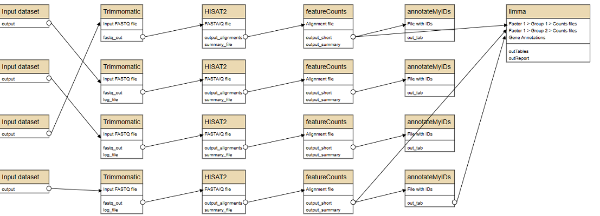

# PancreaticCancer-RNAseq-Limma-Hisat2 🧬

## Description

This repository contains scripts and data files used for a differential expression analysis of RNA-seq data focusing on pancreatic cancer. The primary objective is to identify differentially expressed genes between poorly differentiated Pancreatic Ductal Adenocarcinoma (PDAC) and normal pancreatic samples. The authors primary focus was to understand the expression of the S100P gene in the context of disease and wild-type and the effects of the naphthalene diimide compound QN-302, which targets G-quadruplex DNA sequences in the promoter regions of cancer-related genes. The analysis incorporates the Limma package for differential expression analysis and Hisat2 for RNA sequence alignment.

## Workflow 🧰



The work flow was largley conducted using the galaxy web interface (version 23.0.3), with the exception of the data importation and QC steps conducted using Anaconda powershell's command line.

1. Data importation from SRA using Anaconda's PowerShell.
2. Quality control checks on raw data using FastQC in Anaconda's PowerShell.
3. Trimmomatic functions on data
4. QC on trimmomatic data
5. RNA sequence alignment using Hisat2 in Galaxy (version 23.0.3).
6. FeatureCounts
7. AnnotateMyID
8. Differential expression analysis using Limma in Galaxy (version 23.0.3).

## Getting Started

### Prerequisites

- Limma
- annotateMyIDs
- featurecounts
- Hisat2
- FastQC
- Anaconda
- Galaxy (version 23.0.3)

### Installation

Provide steps on how to install the required software.

#### Example:
1. Install Anaconda from [https://www.anaconda.com/products/distribution](https://www.anaconda.com/products/distribution)
2. Install FastQC:
conda install -c bioconda fastqc


Copy code
3. Setup Galaxy server following instructions from [https://galaxyproject.org/admin/get-galaxy/](https://galaxyproject.org/admin/get-galaxy/)

### Data

Provide information about the dataset being used, such as the data source, and how it can be obtained.

### Usage

#### Importing Data from SRA
```powershell
# Step 1: Open Anaconda's PowerShell

# Step 2: Install the SRA Toolkit
conda install -c bioconda sra-tools

# Step 3: Download the data using the SRA Toolkit. Replace `SRA_ACCESSION` with the actual SRA accession number.
fastq-dump --split-3 SRA_ACCESSION

# Step 4: Optionally specify a different directory to download the data using the -O option.
# Replace '/path/to/your/directory' with the actual directory path.
fastq-dump --split-3 -O /path/to/your/directory SRA_ACCESSION

# Step 5: Optionally download multiple datasets by listing multiple SRA accession numbers.
# Replace 'SRA_ACCESSION1', 'SRA_ACCESSION2', etc with the actual SRA accession numbers.
fastq-dump --split-3 -O /path/to/your/directory SRA_ACCESSION1 SRA_ACCESSION2 SRA_ACCESSION3

# Step 6: Once the data is downloaded, you can proceed to the quality control checks and subsequent analysis steps.


#### Example:
```powershell
# Command in PowerShell for importing data from SRA
Quality Control using FastQC
Provide steps on how to conduct quality control using FastQC.

Example:
powershell
Copy code
# Command in PowerShell for running FastQC
Galaxy Steps
Provide detailed steps on how to use Galaxy for RNA sequence alignment and differential expression analysis.

Results
Provide information on what results/output they should expect.

License
This project is licensed under the [NAME HERE] License - see the LICENSE.md file for details

Acknowledgments
Mention any collaborators, funding bodies, etc.
